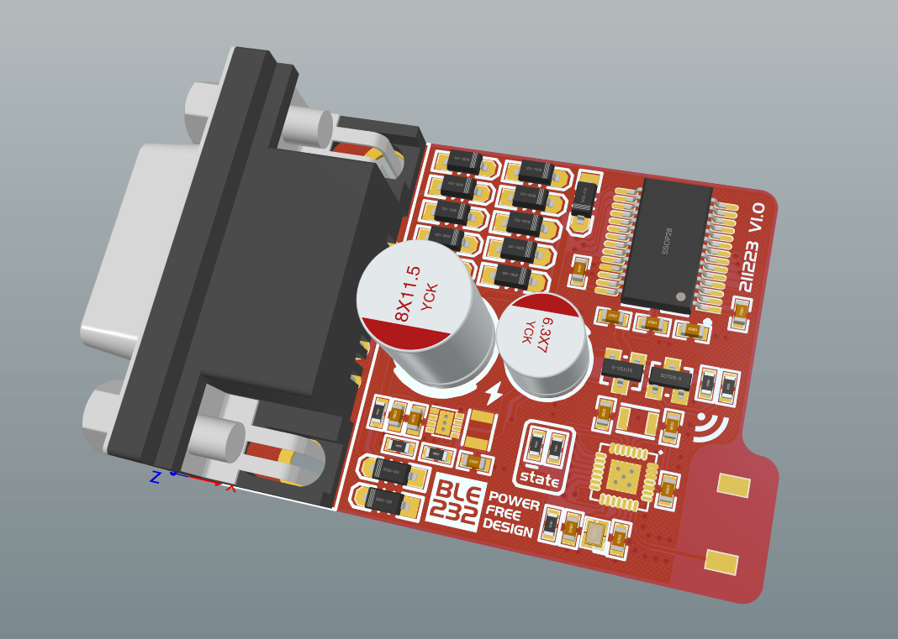

# BLE232

+ 免供电设计的RS232转BLE模块，无需外接电源，模块从RS232数据线上采集电能供自身使用；电能采集使用严格的限流设计且使用高效率电源方案，尽可能小的减轻RS232接口芯片的输出功率；
+ 两个BLE232可互相匹配通信，或使用电脑手机等终端通过蓝牙连接，像普通串口一样收发数据；RS232完整9线可用，除了RI、DCD线以外均可用于全双工，如果要使用RI、DCD，BLE232只能接在DCE（Modem）上；
+ 本项目开发的初衷是为了让电子仪表能够以无线的方式连接电脑上位机，方便我的笔记本电脑采集测量数据，并且能够实现电气隔离；BLE232的电路设计与调试以台式万用表34401A内部的LT1180A接口芯片作为应用场景参考，能够在该万用表的RS232接口上正常工作为设计目标，BLE232可能在一些驱动能力较弱的接口芯片上不能很好的工作；

## 效果图

